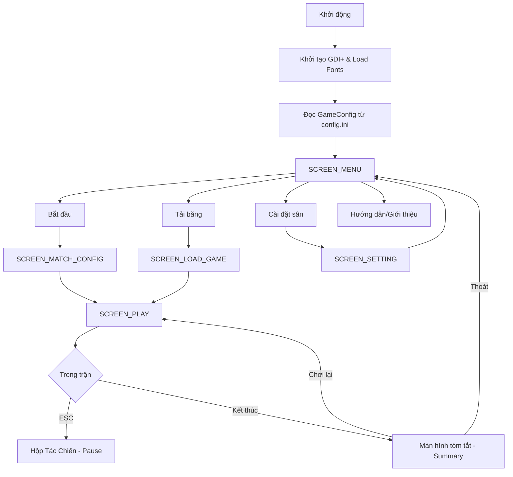

# Caro Champions League

[](https://en.cppreference.com/w/cpp/17)
[](https://learn.microsoft.com/en-us/windows/win32/)
[](https://visualstudio.microsoft.com/vs/)
[](https://learn.microsoft.com/en-us/windows/win32/gdiplus/-gdiplus-gdi-start)
[](https://github.com/anhtuan0806/Gomoku_Game_Project)

**Caro Champions League** là một trò chơi cờ caro (Gomoku) và Tic-Tac-Toe trên nền tảng Windows. Dự án được phát triển hoàn toàn bằng **C++** kết hợp cùng **Win32 API** và **GDI+**, mang đến trải nghiệm đồ họa Pixel Art cổ điển nhưng tinh tế với các hiệu ứng hiện đại.

---

## Mục lục

- [Tính năng nổi bật](#tính-năng-nổi-bật)
- [Yêu cầu hệ thống](#yêu-cầu-hệ-thống)
- [Hướng dẫn build](#hướng-dẫn-build)
- [Cấu trúc dự án](#cấu-trúc-dự-án)
- [Luồng hoạt động](#luồng-hoạt-động)
- [Hệ thống đồ họa & Animation](#hệ-thống-đồ-họa--animation)
- [Cơ chế lưu trữ & Metadata](#cơ-chế-lưu-trữ--metadata)
- [Hệ thống Bot AI](#hệ-thống-bot-ai)
- [Điều khiển](#điều-khiển)

---

## Tính năng nổi bật

### 1. Chế độ thi đấu đa dạng
- **Game Modes:** Caro (15x15) và Tic-Tac-Toe (3x3).
- **Match Types:** 
    - **PvP:** Đối đầu trực tiếp giữa hai kỳ thủ.
    - **PvE:** Thử thách khả năng tư duy với Bot AI thông minh.
- **Series Thể thức:** Bo1, Bo3, Bo5. Hệ thống tự động theo dõi số bàn thắng (`totalWins`) để tính điểm trận (`matchWins`) và phân định nhà vô địch serie.

### 2. Thống kê trận đấu chuyên sâu
- **Tỷ lệ kiểm soát bóng:** Đo lường thời gian suy nghĩ và giữ lượt của từng người chơi (`totalTimePossessed`).
- **Số lần dẫn bóng:** Theo dõi số lượng nước đi thực hiện trong mỗi ván.
- **Bảng tổng sắp:** Hiển thị chi tiết số bàn thắng và số trận thắng serie ngay trên giao diện thi đấu.

### 3. Localization & Font chuyên dụng
- Hỗ trợ đầy đủ tiếng Việt có dấu với bộ font **Be Vietnam Pro** kết hợp cùng font pixel art **VT323**.
- Hệ thống ngôn ngữ linh hoạt (Vietnamese/English).

### 4. Undo/Redo & Autosave
- Khả năng rút lại nước đi và hoàn tác linh hoạt.
- Cơ chế **Autosave** tự động lưu lại trạng thái sau mỗi nước đi quan trọng, đảm bảo không mất dữ liệu giữa chừng.

### 5. Hệ thống Âm thanh & Hiệu năng (V5.1)
- **Asynchronous Audio:** Hệ thống âm thanh được refactor sang cơ chế đa luồng (background thread), xử lý qua hàng đợi lệnh (command queue) để loại bỏ hiện tượng giật lag khi phát nhiều âm thanh cùng lúc.
- **Input Throttling:** Tối ưu hóa việc lọc đầu vào (input filtering) và khống chế tần suất phím nhấn, đảm bảo game phản hồi mượt mà ngay cả khi thao tác nhanh.
- **Main Loop Optimization:** Chuyển đổi sang mô hình "Drain Message Queue" để duy trì tốc độ khung hình ổn định khi nhận lượng lớn tin nhắn từ Windows.

---

## Hệ thống đồ họa & Animation

### Đồ họa Procedural & Pixel Art
- **Sân vận động:** Được vẽ hoàn toàn bằng thuật toán (procedural), bao gồm cỏ sọc, đường biên, và hiệu ứng đèn flash khán đài (`CameraFlash`) nhấp nháy theo thời gian thực.
- **Glassmorphism:** Các bảng điều khiển (Pause, Settings, Match Config) sử dụng hiệu ứng kính mờ với độ trong suốt tùy chỉnh (`Theme::GlassWhite`, `Theme::GlassDark`).
- **Smooth Scaling:** Hệ thống `UIScaler` tự động điều chỉnh tỷ lệ các thành phần UI dựa trên độ phân giải cửa sổ (tối ưu nhất ở 1280x720 hoặc cao hơn).

### Action-Based Animations (V5)
Hệ thống animation cho avatar được cấu trúc theo các hành động cụ thể:
- **Hành động:** `idle` (đứng yên), `run` (di chuyển), `sad` (thua cuộc), `win` (thắng cuộc).
- **Player Cầu thủ:** Tích hợp các model pixel-art chất lượng cao cho **Ronaldo (CR7)**, **Messi (MES)**, và **Neymar (NEY)** với bảng màu (Palette) chuẩn hóa cho từng nhân vật.
- **Logic:** Sử dụng `DrawPixelAction` để lọc và hiển thị frame chính xác dựa trên trạng thái hiện tại của người chơi.

---

## Cấu trúc dự án

```text
Gomoku_Game_Project/                     
└── src/
    ├── ApplicationTypes/           -- Định nghĩa GameState, PlayState, Config
    ├── GameLogic/                  -- Xử lý luật chơi, trọng tài (Rules/Engine/Engineer) và Bot AI
    ├── RenderAPI/                  -- Lõi đồ họa: Renderer, UIComponents, Colours, UIScaler
    ├── ScreenModules/              -- Các màn hình GUI (Menu, Play, Settings, About, Guild,...)
    ├── SystemModules/              -- Hệ thống nền: Audio, SaveLoad, Localization, Time
    ├── main.cpp                    -- Entry point và Game Loop chính
    └── src.vcxproj / .filters      -- Cấu trúc project Visual Studio
```

**Directory Asset chi tiết:**
- `Asset/models/avt_XX/[action]/`: Chứa các frame pixel art theo từng hành động.
- `Asset/models/bg/`: Các mô hình trang trí.
- `Asset/font/`: Font pixel (VT323) và font Unicode (Be Vietnam Pro).
- `Asset/save/`: Các file `slot_N.bin` (Binary format v5).

---

## Luồng hoạt động



### Chi tiết luồng màn hình:
- **SCREEN_MENU**: Điều hướng chính (W/S/Enter).
- **SCREEN_MATCH_CONFIG**: 
    - Trang 1: Chọn Chế độ, PvP/PvE, Độ khó, Time, Target Score (Bo).
    - Trang 2: Chọn Avatar (CR7, MES, NEY,...) và nhập tên.
- **SCREEN_PLAY**: 
    - Vòng lặp: Đợi nước đi -> Kiểm tra thắng/thua -> Chuyển lượt (hoặc Bot tính toán).
    - Hộp Tác Chiến: Lưu game, bật/tắt âm thanh, thoát.
- **SCREEN_LOAD_GAME**: Hiển thị 5 slot lưu + 1 slot Autosave với đầy đủ Metadata (Ngày, giờ, tỷ số).

---

## Cơ chế lưu trữ & Metadata

Chương trình sử dụng hệ thống **Serialization** nhị phân mạnh mẽ với các đặc tính:
- **Version Control:** Hiện hành tại **Version 5**, hỗ trợ đầy đủ match statistics và thông tin serie.
- **Magic Number:** `0xCA05A1E2` để xác thực tính toàn vẹn.
- **SaveMetadata:** Mỗi bản lưu bao gồm:
    - Tên hiển thị tùy chỉnh (Save Name).
    - Dấu thời gian (Timestamp) tự động.
    - Toàn bộ lịch sử bước đi (`matchHistory`) và `redoStack`.
    - Trạng thái bàn cờ 20x20.

---

## Hệ thống Bot AI

Bot AI (PLAYER 2) hoạt động trên một luồng riêng biệt (`std::async`) để tránh gây gián đoạn giao diện người dùng:
1. **Phân Hạng Đồng (Easy):** Nước đi ngẫu nhiên, mô phỏng người chơi mới.
2. **Phân Hạng Vàng (Medium):** Sử dụng hàm đánh giá heuristic cơ bản, ưu tiên phòng thủ và chặn các chuỗi nguy hiểm.
3. **Thách Đấu (Hard):** 
    - **Thuật toán:** Alpha-Beta Pruning kết hợp **Zobrist Hashing**.
    - **Tối ưu hiệu năng:** 
        - **Transposition Table (TT):** Lưu trữ 1,048,576 trạng thái đã tính toán (~32MB RAM) giúp bỏ qua các nhánh trùng lặp.
        - **Incremental Evaluation:** Đánh giá điểm bàn cờ dựa trên nước đi mới thay vì quét lại từ đầu.
        - **Move Ordering:** Ưu tiên duyệt các nước đi có tiềm năng cao để tối đa hóa khả năng cắt tỉa nhánh.
        - **Branching Limit:** Giới hạn nhánh (12) tại các nút sâu để duy trì tốc độ phản hồi < 500ms.
    - **Độ sâu tìm kiếm:** 5 lớp (có thể mở rộng tùy cấu hình).
    - **Chiến thuật:** Phát hiện và xử lý ngay lập tức các mối đe dọa thắng/thua (Immediate Win/Block).

---

## Điều khiển

### Điều hướng chung
| Phím | Chức năng |
| :--- | :--- |
| **W/S** | Di chuyển lên/xuống giữa các mục |
| **A/D** | Thay đổi giá trị (Âm lượng, Ngôn ngữ, Chế độ) |
| **Enter / Space**| Xác nhận / Chọn |
| **ESC** | Quay lại / Thoát |

### Trong trận đấu (PlayScreen)
| Phím | Chức năng |
| :--- | :--- |
| **WASD / Mũi tên**| Di chuyển con trỏ trên sân |
| **Enter / Space** | Thực hiện cú đặt quân (Đặt bóng) |
| **Q** | Undo - Rút lại nước đi (PvE) |
| **E** | Redo - Hoàn tác (PvE) |
| **ESC** | Mở Hộp Tác Chiến (Pause Menu) |
| **S** | Lưu game nhanh |

---

## Yêu cầu hệ thống & Build

- **OS:** Windows 10/11 (Architecture x86).
- **IDE:** Visual Studio 2022.
- **Bộ công cụ:** MSVC C++17 trở lên.
- **Thư viện:** GDI+ (Window SDK), WinMM (Multimedia).

**Các bước build:**
1. Clone repository và mở `src/src.sln`.
2. Build Solution ở chế độ `Release` / `x86`.

---

© 2026 Nhóm 3 - 25CTT7. Dự án được phát triển cho mục đích giáo dục.

MSV: 24120260 | 24120421 | 24120428 | 24120451

GVHD: Trương Toàn Thịnh.