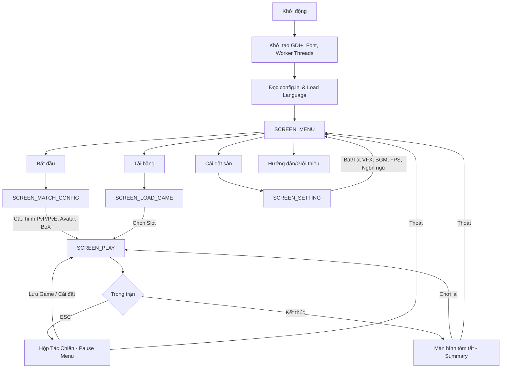

# Caro Champions League

[](https://en.cppreference.com/w/cpp/17)
[](https://learn.microsoft.com/en-us/windows/win32/)
[](https://visualstudio.microsoft.com/vs/)
[](https://learn.microsoft.com/en-us/windows/win32/gdiplus/-gdiplus-gdi-start)
[](https://github.com/anhtuan0806/Gomoku_Game_Project)

**Caro Champions League** là một trò chơi cờ caro (Gomoku) và Tic-Tac-Toe trên nền tảng Windows. Dự án được phát triển hoàn toàn bằng **C++** kết hợp cùng **Win32 API** và thư viện đồ họa **GDI+**, mang đến trải nghiệm đồ họa Pixel Art cổ điển nhưng tinh tế với các hiệu ứng hình ảnh hiện đại (Glassmorphism, Procedural Animation).

Dự án này là Đồ án môn học Cơ sở lập trình, được mở rộng với hàng loạt tính năng nâng cao về AI, đồ họa, và quản lý hệ thống.

---

## Mục lục

1. [Tính năng nổi bật](#tính-năng-nổi-bật)
2. [Hệ thống đồ họa & UI](#hệ-thống-đồ-họa--ui)
3. [Hệ thống Âm thanh](#hệ-thống-âm-thanh)
4. [Hệ thống Bot AI](#hệ-thống-bot-ai)
5. [Cơ chế Lưu trữ & Metadata](#cơ-chế-lưu-trữ--metadata)
6. [Cấu trúc dự án](#cấu-trúc-dự-án)
7. [Luồng hoạt động](#luồng-hoạt-động)
8. [Điều khiển](#điều-khiển)
9. [Yêu cầu hệ thống & Build](#yêu-cầu-hệ-thống--build)

---

## Tính năng nổi bật

### 1. Chế độ thi đấu đa dạng
- **Game Modes:** Hỗ trợ cả **Caro** (bàn cờ 15x15, điều kiện thắng 5) và **Tic-Tac-Toe** (bàn cờ 3x3, điều kiện thắng 3).
- **Match Types:** 
  - **PvP:** Đấu đối kháng trực tiếp giữa hai người chơi trên cùng một máy.
  - **PvE:** Thử thách khả năng tư duy với Bot AI tích hợp nhiều độ khó.
- **Series Thể thức:** Thi đấu theo chuỗi Bo1, Bo3, Bo5. Hệ thống tự động theo dõi tỷ số (`totalWins`), đếm số ván thắng và phân định nhà vô địch của serie.

### 2. Thống kê trận đấu chuyên sâu
- **Tỷ lệ kiểm soát bóng:** Đo lường thời gian suy nghĩ và giữ lượt của từng người chơi (`totalTimePossessed`).
- **Số lần dẫn bóng:** Theo dõi số lượng nước đi (`movesCount`) đã thực hiện trong mỗi ván.
- **Bảng tổng sắp:** Hiển thị chi tiết số ván thắng và điểm số của chuỗi ngay trên giao diện thi đấu.

### 3. Đa Ngôn Ngữ & Tùy biến
- Hỗ trợ **Tiếng Việt** (có dấu) và **Tiếng Anh**.
- Hệ thống Load file ngôn ngữ động từ `Asset/lang/vi.txt` và `en.txt`.
- Sử dụng font Pixel Art **VT323** được nhúng trực tiếp.

### 4. Undo/Redo linh hoạt
- Khả năng **Rút lại nước đi (Undo)** và **Hoàn tác (Redo)** thông qua việc lưu lại lịch sử `matchHistory` và `redoStack`, hữu ích trong chế độ PvE để học hỏi và sửa sai.

---

## Hệ thống đồ họa & UI

### Đồ họa Procedural & Pixel Art
- **Sân vận động (Stadium):** Nền sân cỏ được vẽ hoàn toàn bằng thuật toán (procedural drawing), kết hợp hiệu ứng đèn flash khán đài (`CameraFlash`), mây bay (`clouds`), và bóng bay lơ lửng (`balloons`).
- **Hiệu ứng Kính mờ (Glassmorphism):** Các bảng điều khiển (Pause, Settings, Match Config) sử dụng hiệu ứng kính mờ trong suốt, tạo cảm giác sang trọng (`Theme::GlassWhite`, `Theme::GlassDark`).
- **Smooth UI Scaling:** Tích hợp module `UIScaler` tự động điều chỉnh tỷ lệ các thành phần giao diện một cách sắc nét khi cửa sổ thay đổi kích thước. Tối ưu nhất ở độ phân giải `1280x720` trở lên.
- **Quản lý Cache Đồ Họa:** Sử dụng cơ chế Double Buffering để loại bỏ nhấp nháy, kết hợp với cache Bitmap và Brush (`g_ModelCache`, `g_BrushCache`) giúp giảm tải CPU khi render.

### Hệ thống Animation Cầu thủ (Action-Based)
Hệ thống animation cho các Avatar hoạt động dựa trên các chuỗi sprite (spritesheet dạng txt):
- **Trạng thái hành động:** `idle` (đứng yên), `run` (di chuyển), `sad` (thua cuộc/mất bóng), `win` (thắng cuộc/ăn mừng).
- **Bộ Avatar cao cấp:** Tích hợp model pixel-art cho các siêu sao bóng đá như **Ronaldo (CR7)**, **Messi (MES)**, và **Neymar (NEY)**, với hệ thống Palette màu tuỳ chỉnh riêng cho da, tóc, áo đấu.

---

## Hệ thống Âm thanh

- **Cấu trúc Đa luồng (Multithreaded):** Xử lý phát âm thanh thông qua API `mciSendString` của WinMM. SFX được đẩy vào hàng đợi (`std::queue`) và xử lý bởi một luồng nền (`sfxWorker`) để đảm bảo UI không bao giờ bị đứng khi tải hoặc phát âm thanh.
- **Quản lý trạng thái:** Tách biệt luồng nhạc nền (BGM - hỗ trợ vòng lặp) và hiệu ứng âm thanh (SFX). Có thể tùy chỉnh âm lượng (0-100%) và bật/tắt độc lập.

---

## Hệ thống Bot AI

Bot AI (PLAYER 2) được thiết kế đặc biệt, không làm gián đoạn trải nghiệm người dùng, phân cấp thành 3 độ khó:

1. **Phân Hạng Đồng (Easy):** 
   - Lựa chọn nước đi ngẫu nhiên hoặc các ô lân cận để mô phỏng người chơi mới.
2. **Phân Hạng Vàng (Medium):** 
   - Sử dụng hàm đánh giá Heuristic. Quét các hướng (Ngang, Dọc, 2 Đường chéo), phát hiện các đầu hở (`openEnds`) và số quân liên tiếp để tính điểm Tấn công (Attack Score) và Phòng thủ (Defense Score).
3. **Thách Đấu (Hard - Alpha-Beta Pruning & Zobrist Hashing):**
   - Áp dụng thuật toán **Minimax kết hợp Alpha-Beta Pruning** với độ sâu mặc định là 5 lớp.
   - **Transposition Table (TT):** Áp dụng **Zobrist Hashing** để lưu trữ và tra cứu các trạng thái đã đánh giá (TT size lên tới ~1 triệu mục ~ 32MB RAM). Tránh việc duyệt lại các nhánh trùng lặp, tăng đáng kể tốc độ phản hồi.
   - **Move Ordering:** Các nước đi được tính điểm heuristic sơ bộ và sắp xếp trước khi đưa vào Alpha-Beta. Các nhánh tốt nhất được duyệt trước, tối đa hóa khả năng cắt tỉa. Nhánh tìm kiếm bị giới hạn (branching limit = 12) ở các tầng sâu để đảm bảo thời gian phản hồi `< 500ms`.
   - **Fast Quiescence / Immediate Win:** Tối ưu O(1) kiểm tra thắng/chặn thua ngay lập tức chỉ quanh vị trí nước đi cuối, tiết kiệm tài nguyên CPU thay vì quét toàn bàn cờ O(N²).

---

## Cơ chế Lưu trữ & Metadata

Chương trình sử dụng hệ thống **Serialization Nhị Phân (Binary)** với hiệu suất cao:
- **Version Control:** File lưu tương thích ngược, hiện hành ở **Version 5**.
- **Tính toàn vẹn (Magic Number):** Mỗi file sử dụng khóa `0xCA05A1E2` để xác thực file hợp lệ, chống crash khi đọc file hỏng.
- **Lưu trữ Metadata toàn diện:** Mỗi Slot (tối đa 5 slots) lưu trữ:
  - Tên hiển thị do người chơi tự đặt.
  - Timestamp (Ngày/Giờ lưu tự động).
  - Thống kê toàn ván: Chế độ, Độ khó, Điểm số, tổng thời gian.
  - Chi tiết lượt đi: `matchHistory`, `redoStack`, trạng thái bàn cờ 20x20.

---

## Cấu trúc dự án

Kiến trúc phần mềm theo dạng **Modular Procedural** (chia module nhưng không thuần OOP để tối ưu memory footprint):

```text
    src/
    ├── ApplicationTypes/           -- Kiểu dữ liệu nền 
    |   ├── GameConfig.h            -- Cấu hình Game
    |   ├── GameConstants.h         -- Hằng số Game
    |   ├── GameState.h             -- Trạng thái Game
    |   └── PlayState.h             -- Trạng thái Game (Play Mode)
    ├── GameLogic/                  -- Bộ não Game
    |   ├── BotAI.h                 -- Bot AI
    |   ├── GameEngine.h            -- Engine Game
    |   ├── Rules.h                 -- Luật chơi
    |   └── PlayerEngineer.h        -- Player Engineer
    ├── RenderAPI/                  -- Lõi đồ họa
    |   ├──Colours.h                -- Colours
    |   ├──Renderer.h               -- Renderer (GDI+ setup)
    |   ├──UIComponents.h           -- UI Components
    |   └──UIScaler.h               -- UI Scaler
    ├── ScreenModules/              -- Các module GUI 
    |   ├──MenuScreen.h             -- Main Menu
    |   ├──MatchConfigScreen.h      -- Match Config
    |   ├──PlayScreen.h             -- Play Screen
    |   ├──SettingsScreen.h         -- Settings
    |   ├──LoadGameScreen.h         -- Load Game
    |   ├──GuildScreen.h            -- Guild
    |   └──AboutScreen.h            -- About
    ├── SystemModules/              -- Các Subsystems
    |   ├──AudioSystem.h            -- Audio System
    |   ├──SaveLoadSystem.h         -- Save Load System
    |   ├──Localization.h           -- Localization
    |   ├──ConfigLoader.h           -- Config Loader
    |   |──TimeSystem.h             -- Time System 
    |   |──EngineStats.h            -- Engine Stats
    |   └──WinApiHandler.h          -- WinApi Handler
    |── main.cpp                    -- Vòng lặp chính, xử lý Windows Message (WndProc)
    |── Asset/
    |   |── audio/                  -- File BGM (.mp3) và SFX (.wav)
    |   |── font/                   -- Font VT323
    |   |── lang/                   -- File đa ngôn ngữ (.txt)
    |   |── models/                 -- Sprite tọa độ Pixel Art (avatar, background)
    |   └── save/                   -- Thư mục chứa các file slot_X.bin
    |── README.md                   -- file hướng dẫn sử dụng
    |── src.sln                     -- file solution
    |── src.vcxproj                 -- file project
    └── src.vcxproj.filters         -- file filter
```

---

## Luồng hoạt động



---

## Điều khiển

| Bối Cảnh | Phím | Chức năng |
| :--- | :--- | :--- |
| **Menu / Settings** | `W` / `S` (Mũi tên) | Lên/Xuống giữa các mục |
| | `A` / `D` (Trái/Phải) | Tăng/Giảm giá trị (Âm lượng, FPS, Ngôn ngữ) |
| | `Enter` / `Space` | Xác nhận / Chọn |
| | `ESC` | Quay lại / Thoát |
| **Trong Trận (Play)** | `W, A, S, D` / Mũi tên | Di chuyển con trỏ trên sân |
| | `Enter` / `Space` | Đánh quân (Đặt bóng) |
| | `Q` | Undo - Rút lại nước đi (PvE) |
| | `E` | Redo - Hoàn tác (PvE) |
| | `ESC` | Mở Hộp Tác Chiến (Pause Menu) |
| | `S` (khi Pause) | Cắt nhanh đến màn hình lưu game |

---

## Yêu cầu hệ thống & Build

- **Hệ Điều Hành:** Windows 10/11.
- **Môi trường phát triển:** Visual Studio 2022 (khuyến nghị).
- **Bộ công cụ (Toolset):** MSVC C++17 trở lên.
- **Thư viện nền tảng:** Windows SDK (Win32 API, GDI+, WinMM). Không yêu cầu thư viện bên thứ ba bên ngoài Windows.

**Hướng dẫn Build:**
1. Clone dự án.
2. Mở file `src.sln` trong thư mục `src` bằng Visual Studio.
3. Chuyển cấu hình build sang **Release** và nền tảng **x86** (ứng dụng biên dịch ở dạng 32-bit).
4. Nhấn `Ctrl + Shift + B` (Build Solution) và `F5` để chạy ứng dụng.

---

© 2026 Nhóm 3 - 25CTT7. Dự án được phát triển cho mục đích giáo dục thuộc Khoa Công Nghệ Thông Tin, ĐH KHTN TP.HCM.

**Thành viên:** 24120260 | 24120421 | 24120428 | 24120451  
**GVHD:** Trương Toàn Thịnh.
