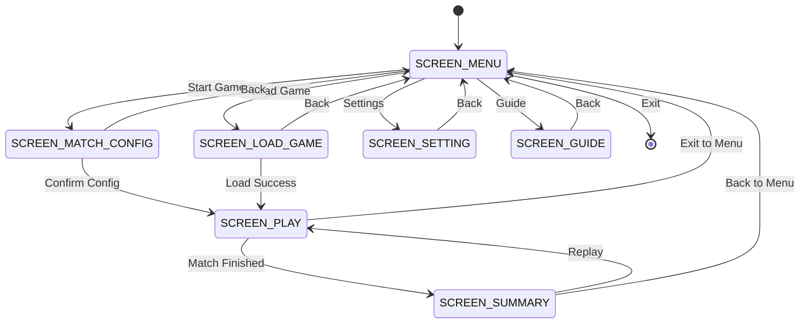
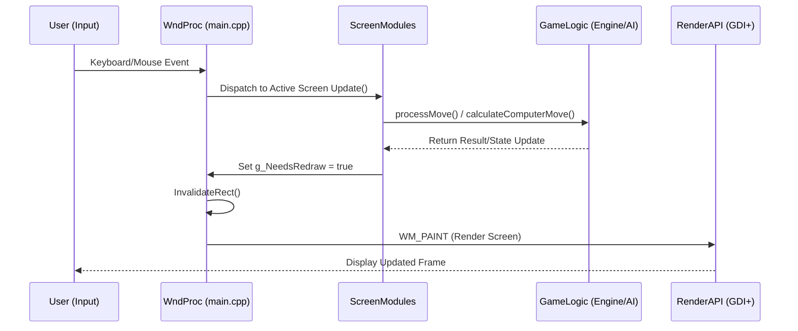
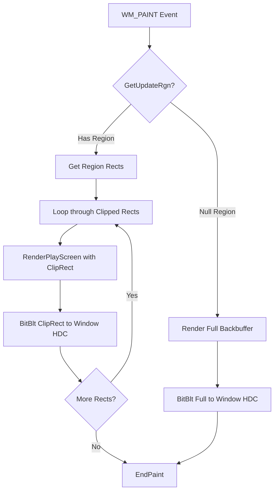

# Caro Champions League (Technical Overview)

[](https://en.cppreference.com/w/cpp/17)
[](https://learn.microsoft.com/en-us/windows/win32/)
[](https://learn.microsoft.com/en-us/windows/win32/gdiplus/-gdiplus-gdi-start)

**Caro Champions League** là một trò chơi cờ caro (Gomoku) và Tic-Tac-Toe hiệu năng cao được phát triển bằng **Modern C++ (C++17)** và **Win32 API**. Dự án tập trung vào việc tối ưu hóa hiệu suất đồ họa 2D thông qua GDI+ và xây dựng hệ thống AI thông minh dựa trên các thuật toán tìm kiếm hiện đại.

---

## 1. Kiến trúc Hệ thống (System Architecture)

Dự án được xây dựng theo mô hình **Modular Procedural** với trung tâm là máy trạng thái hữu hạn (FSM):

### State Machine & Navigation
- **Screen Management:** Sử dụng enum `ScreenState` để điều hướng giữa các module màn hình (`SCREEN_MENU`, `SCREEN_PLAY`, `SCREEN_SETTING`,...).



- **PlayState Lifecycle:** Toàn bộ dữ liệu của một trận đấu được đóng gói trong struct `PlayState`, bao gồm:
  - Ma trận bàn cờ 2D (`board[15][15]`).
  - Lịch sử nước đi (`matchHistory`) và stack phục hồi (`redoStack`) dạng `std::vector<std::pair<int, int>>`.
  - Thống kê thời gian thực: `totalTimePossessed`, `movesCount`, `timeRemaining`.

### Luồng xử lý (Data Flow)
Hệ thống xử lý theo mô hình Event-Driven:



---

## 2. Pipeline Đồ họa & Rendering

Hệ thống đồ họa được tối ưu để đạt tốc độ khung hình ổn định và không nhấp nháy:

- **Double Buffering:** Sử dụng struct `DoubleBuffer` quản lý HDC bộ nhớ và HBITMAP. Toàn bộ nội dung được vẽ lên buffer ẩn trước khi `BitBlt` lên màn hình chính.
- **Dirty Region Rendering:** Tối ưu hóa `WM_PAINT` bằng cách sử dụng `GetUpdateRgn`. Hệ thống chỉ render và blit những vùng bị thay đổi (Clipped Regions), giúp giảm đáng kể tải CPU khi chơi trên bàn cờ lớn.


- **UIScaler (Resolution Independence):** Toàn bộ tọa độ UI được tính toán tương đối dựa trên baseline `1280x720`. Các helper `SX()`, `SY()`, `S()` tự động scale tọa độ và kích thước font theo kích thước cửa sổ thực tế.
- **Graphics Caching:** Lưu trữ sẵn các `SolidBrush`, `Pen` và `Bitmap` trong cache (`g_ModelCache`) để tránh việc khởi tạo lại tài nguyên GDI+ liên tục trong vòng lặp render.

---

## 3. Game Logic & Thuật toán AI

### Hệ thống Luật chơi (GameRules)
- Thuật toán quét 4 hướng (Ngang, Dọc, 2 Chéo) với độ phức tạp O(1) quanh vị trí vừa đánh để kiểm tra điều kiện thắng.
- Hỗ trợ luật chặn 2 đầu (Gomoku chuẩn) và cơ chế hòa cờ khi bàn cờ kín.

### Bot AI (Minimax & Optimization)
Bot AI cấp độ "Thách Đấu" áp dụng các kỹ thuật tiên tiến trong lý thuyết trò chơi:
- **Minimax với Alpha-Beta Pruning:** Cắt tỉa các nhánh tìm kiếm không hiệu quả, cho phép duyệt sâu tới 5-7 lớp.
- **Zobrist Hashing:** Sử dụng 64-bit hash để đại diện cho trạng thái bàn cờ. Chuyển đổi trạng thái bàn cờ sang mã hash trong O(1) sau mỗi nước đi.
- **Transposition Table (TT):** Lưu trữ kết quả các trạng thái đã đánh giá vào bảng băm (~1 triệu entries). Tránh tính toán lặp lại các hoán vị của nước đi.
- **Move Ordering:** Sắp xếp các nước đi dựa trên điểm Heuristic sơ bộ để tối đa hóa khả năng cắt tỉa của Alpha-Beta.
- **Heuristic Evaluation:** Hàm đánh giá tính toán điểm số dựa trên:
  - Chuỗi quân liên tiếp (Consecutive pieces).
  - Số đầu hở (Open ends).
  - Vị trí chiến lược trên bàn cờ.

---

## 4. Các Hệ thống Phụ trợ (Subsystems)

### Multi-threaded Audio System
- **SFX Worker:** Sử dụng luồng riêng (`std::thread`) và hàng đợi (`std::queue`) để xử lý các yêu cầu phát âm thanh SFX bất đồng bộ, đảm bảo luồng UI luôn mượt mà.
- **API:** Sử dụng `mciSendString` của WinMM để phát nhạc nền (.mp3) và hiệu ứng (.wav).

### Serialization & Persistence
- **Binary Format:** Lưu trữ game và cấu hình dưới dạng nhị phân để tối ưu kích thước và tốc độ đọc/ghi.
- **Data Integrity:** Sử dụng Magic Number (`0xCA05A1E2`) và Versioning để kiểm tra tính hợp lệ của file lưu, đảm bảo tương thích ngược hoặc báo lỗi chính xác khi file bị hỏng.

### High-Precision Timing
- Sử dụng `CreateWaitableTimer` kết hợp `timeBeginPeriod(1)` để đạt được độ chính xác 1ms cho việc quản lý khung hình (Frame Timing) và các bộ đếm ngược thời gian suy nghĩ.

---

## 5. Cấu trúc Thư mục

```text
src/
├── ApplicationTypes/    -- Định nghĩa GameState, PlayState, GameConfig
├── Asset/               -- Tài nguyên game: Fonts, Images, Textures
├── GameLogic/           -- Xử lý GameEngine, GameRules, BotAI
├── RenderAPI/           -- Lõi đồ họa: Renderer, UIScaler, UIComponents
├── ScreenModules/       -- Logic xử lý cho từng màn hình UI riêng biệt
├── SystemModules/       -- Subsystems: Audio, SaveLoad, Config, Time
├── main.cpp             -- Entry point, WndProc và vòng lặp tin nhắn Win32
├── src.sln              -- Solution file cho Visual Studio
├── src.vcxproj.filters  -- Filter file cho Visual Studio
└── src.vcxproj          -- File cho Visual Studio
```

---

## 6. Yêu cầu & Build

- **Compiler:** MSVC hỗ trợ C++17 trở lên.
- **IDE:** Visual Studio 2022.
- **Dependencies:** Windows SDK (GDI+, WinMM).
- **Build:** Chuyển sang cấu hình **Release | x86** và build solution `src.sln`.

---
© 2026 Nhóm 3 - 25CTT7. Dự án được phát triển cho mục đích giáo dục thuộc Khoa CNTT, ĐH KHTN TP.HCM.
**Thành viên:** 24120260 | 24120421 | 24120428 | 24120451  
**GVHD:** Trương Toàn Thịnh.
